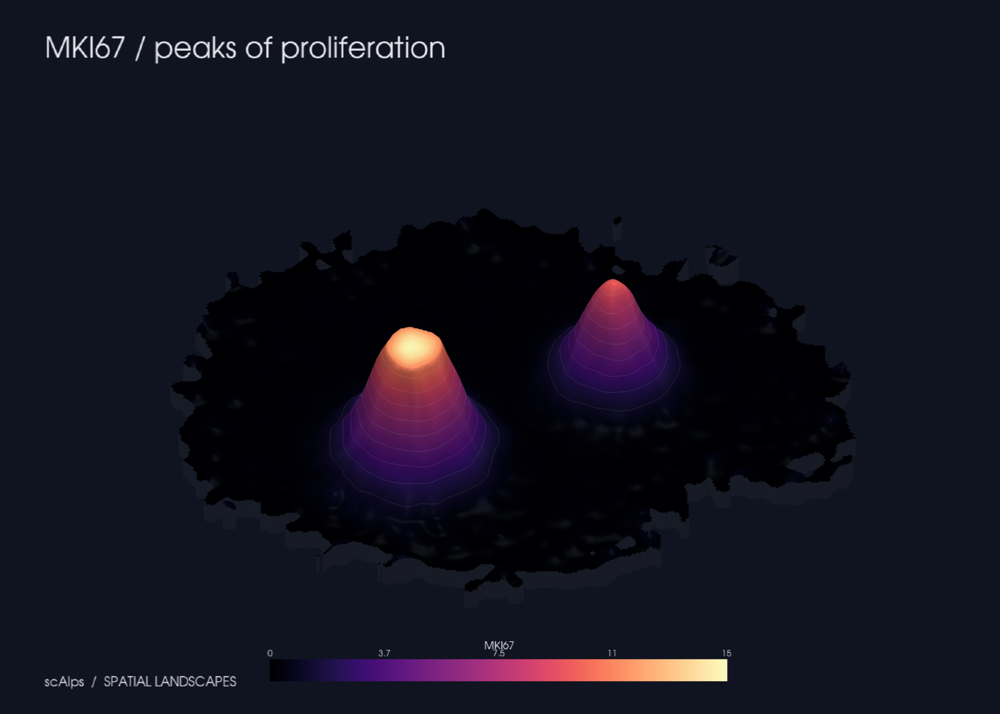
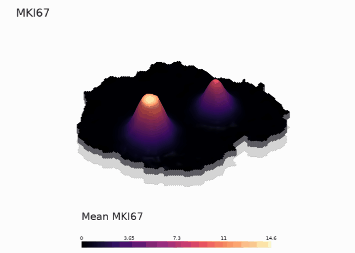
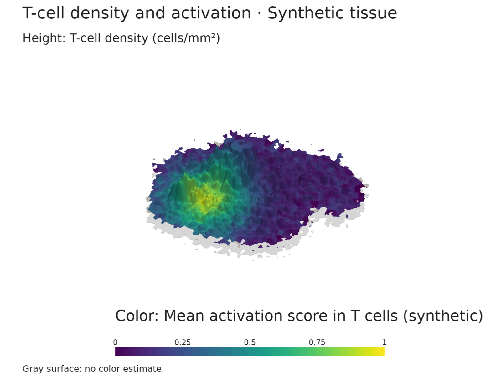

<p align="center">
  
</p>

[](https://scalps.readthedocs.io/en/latest/)

[Documentation](https://scalps.readthedocs.io/en/latest/) · [API reference](https://scalps.readthedocs.io/en/latest/api/) · [Recipes](https://scalps.readthedocs.io/en/latest/recipes/)

**Your tissue has a landscape. Go explore it.**

Turn spatial single-cell data into mountains, valleys and islands with PyVista.
Cell density, cell types, genes, pathway scores: one small API, three visual moods.



```python
import scalps as sca

sca.plot(adata)  # cell density
sca.plot(adata, "MKI67", preset="ember")  # gene expression
sca.plot(adata, "prolif_score", preset="glacier")  # obs score
sca.plot(adata, groupby="cell_type", groups="T cell")  # cell-type density
```

AnnData coordinates live in `adata.obsm["spatial"]`, in micrometers by default.
Expression is read as supplied: scAlps does **not** silently normalize or log it.

## Install

Python 3.11 or newer. From this repository:

```bash
pip install -e .
pip install -e '.[notebook,spatial]'  # optional HTML/Jupyter and SpatialData
```

Install directly from the public GitHub repository:

```bash
pip install 'scalps @ git+https://github.com/philinscience/scAlps.git'
```

For development against the sibling PyVista checkout:

```bash
pip install -e ../pyvista
pip install -e '.[dev,notebook,spatial]'
```

## Start with a mountain

No data downloads needed. This is **synthetic** tissue, not a biological result.

```python
adata = sca.demo()
mountain = sca.terrain(adata, "MKI67", resolution=300, smooth=2.5)
mountain.plot(preset="ember")
mountain.save("outputs/mki67.png", preset="ember")
mountain.save("outputs/mki67.html", preset="ember")  # interactive, notebook extra
mountain.save("outputs/mki67.gif", preset="ember")  # slow orbit, about 24 seconds
```

Or `scalps demo --value MKI67 --preset ember -o outputs/demo.png`.



## Choose your landscape

| What to show | Call |
| --- | --- |
| All-cell density | `sca.terrain(adata)` |
| T-cell density | `sca.terrain(adata, groupby="cell_type", groups="T cell")` |
| Local T-cell fraction | `sca.terrain(adata, groupby="cell_type", groups="T cell", statistic="fraction")` |
| Gene from a layer | `sca.terrain(adata, "MKI67", layer="counts")` |
| Numeric score | `sca.terrain(adata, "prolif_score")` |
| Signed score, including valleys | `sca.terrain(adata, "immune_balance")` |
| Custom per-cell values | `sca.terrain(adata, my_array)` |

## Independent height and color

Keep T-cell density as height and color it by a gene or score in those T cells:

```python
mountain = sca.terrain(
    adata, groupby="cell_type", groups="T cell",
    color="Cd8a", color_layer="log1p_norm",
)
mountain.plot(cmap="viridis", title="T-cell density and Cd8a")
```

Omit `color` to keep the original behavior: height and color encode the same field.
With `color`, its mean is computed among the selected cells, independently of
height, using the same grid and smoothing. The figure labels both encodings.
`vmax` controls height; `clim` controls color. Contours follow height.
Gray surface regions have no color estimate; zero expression is a valid value.



This illustration uses the explicitly **synthetic** `activation_score` in
`sca.demo()`. Cd8a expression is a gene measurement, not an activation score.
See [the recipe](docs/recipes.md#independent-height-and-color) for the real GS52
example in native coordinate units and a reproducible rendering script.

`alpine`, `ember`, and `glacier` select the terrain palette. Every preset uses
a **white background**, regular sans-serif labels, and a separate color-bar
panel. Figures have no branding or watermark. Signed values automatically use
a diverging colormap. Customize `cmap`, `height`, `clim`, `vmax`, `contours`, and `skirt`.

```python
mountain.save("outputs/figure.png", transparent_background=True)
mountain.plot(scalar_bar_title="Mean expression (log-normalized)", skirt=False)
```

The default view includes a flat gray tissue footprint below the terrain.
Hide it with `footprint=False`, or adjust `footprint_color` and `footprint_gap`.
Sparse surroundings are trimmed using `density_percentile=1` of all-cell local
density; use `sca.terrain(adata, "MKI67", density_percentile=0)` to disable this.
The cutoff is independent of the gene or selected cell type.

For real Xenium data, [examples/xenium.py](examples/xenium.py) renders gene and
cell-density panels from an h5ad file. It loads selected genes from the supplied
layer and keeps unknown coordinate units explicit; see [the recipe](docs/recipes.md).

## SpatialData

```python
# Use a table's existing obsm coordinates:
sca.plot(sdata, "MKI67", table="table")

# Or derive and align centroids in a named coordinate system:
sca.plot(sdata, "MKI67", table="table", element="cell_boundaries", coordinate_system="global")
```

Explicit elements use SpatialData transformations and align centroids by the
table's region/instance IDs, never by incidental row order. A table-only call
uses `obsm` as supplied; it does not transform those coordinates.

## Honest mountains

Height is a visual encoding, **not physical tissue elevation**. By default the
99th percentile of absolute values sets peak height, and outliers are clipped
in geometry only; color and exported values retain their original units. Use a
shared `vmax` and `clim` when comparing slides. Matching physical bandwidth and
coordinate extent also matters; see [the method](docs/method.md).

- Mean fields smooth cell sums and counts separately, then divide. Missing values
  contribute to neither. Real zeros remain zeros.
- Density is Gaussian-smoothed cell count per area, not occupancy-normalized.
  The default is cells/mm² for micrometer coordinates.
- Tissue support comes from all-cell occupancy and a default first-percentile
  density cutoff sampled at cell locations. Large empty gaps are removed;
  nearby regions can merge at the chosen smoothing scale.
- Genes are sliced before materialization, so sparse expression stays practical.
- Exports include JSON settings; `.npz` keeps values, both support masks, counts and coordinates.

## Learn more

[Quickstart](https://scalps.readthedocs.io/en/latest/) · [Recipes](https://scalps.readthedocs.io/en/latest/recipes/) ·
[API](https://scalps.readthedocs.io/en/latest/api/) · [Method & limitations](https://scalps.readthedocs.io/en/latest/method/) ·
[Example notebook](examples/quickstart.ipynb)

```bash
pip install -e '.[dev,notebook,spatial]'
pytest
mkdocs serve
```

This is an early research tool; no PyPI release is configured. Documentation
is hosted on [Read the Docs](https://scalps.readthedocs.io/en/latest/).
Built on [PyVista](https://docs.pyvista.org/),
[AnnData](https://anndata.readthedocs.io/), and
[SpatialData](https://spatialdata.scverse.org/).
