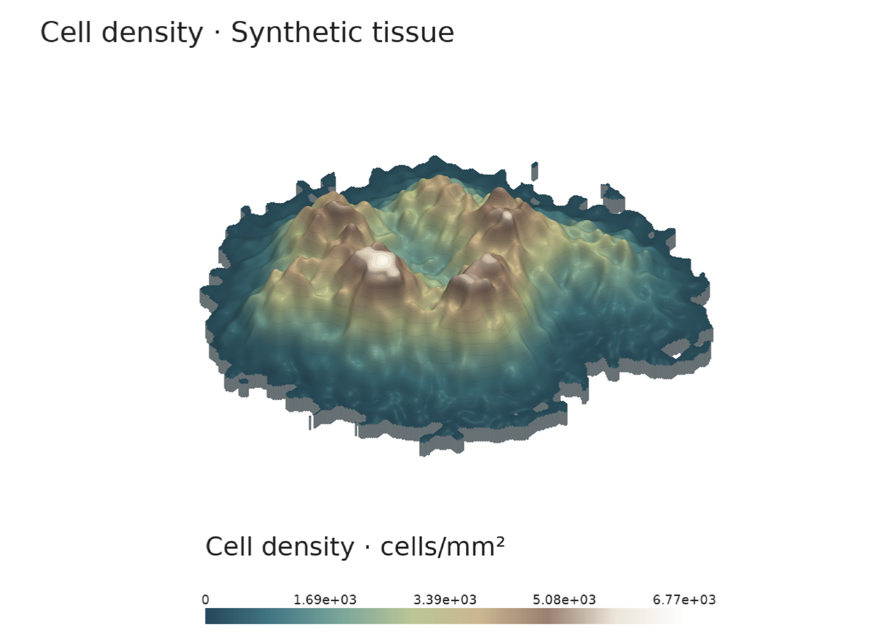
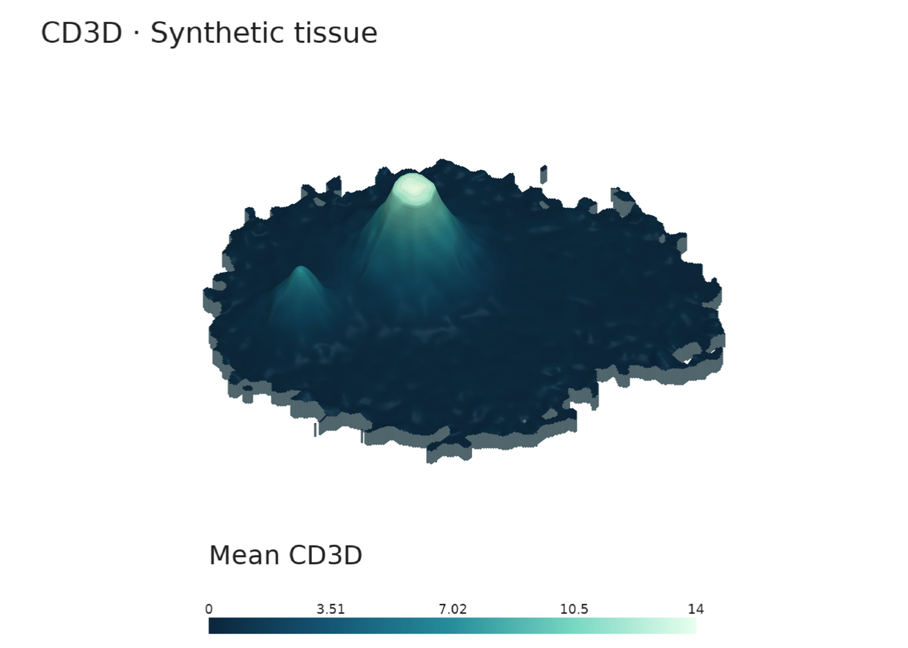

# Your tissue has a landscape

scAlps turns spatial single-cell measurements into explorable 3D terrain.
It accepts AnnData and SpatialData and renders with PyVista.


## Install and explore

```bash
pip install -e '.[notebook,spatial]'
scalps demo --value MKI67 --preset ember -o outputs/demo.png
```

```python
import scalps as sca

adata = sca.demo()  # reproducible synthetic cells; no download
sca.plot(adata, "MKI67", preset="ember")
```

For your Xenium data, supply cell centroids in `adata.obsm["spatial"]`.
Use a gene name, numeric `obs` column or no value for cell density.
Coordinates default to micrometers; see [units and methods](method.md).

## Build once, explore and export

```python
mountain = sca.terrain(adata, "MKI67", resolution=300, smooth=2.5)
mountain.plot(preset="alpine")
mountain.save("outputs/mountain.png", preset="ember")
mountain.save("outputs/mountain.html", preset="ember")
mountain.save("outputs/mountain.gif", preset="ember", frames=90, fps=24)
mountain.save("outputs/mountain.npz")
mountain.save("outputs/mountain.vtp")
```

HTML is an interactive standalone scene (rotate, zoom, pan). It needs the
`notebook` extra. PNG and GIF exports render off screen. Every export has a
`.json` sidecar containing aggregation settings and render settings.

## Three moods

| Alpine | Ember | Glacier |
| --- | --- | --- |
|  |  |  |

These images use synthetic data. Their height represents measurements, not anatomy.
All presets use white backgrounds and regular sans-serif legends. Use
`mountain.save("figure.png", transparent_background=True)` for a transparent PNG.
See [real Xenium examples and figure styling](recipes.md) for plots from your data.

## Running on servers and in notebooks

On servers, use `save()` or `plot(off_screen=True, show=False)`. A working VTK
OpenGL backend is still needed. Recent VTK wheels can use EGL; older systems
may need Mesa and `xvfb-run`. If rendering fails, numerical `terrain()` and NPZ
export do not require a display.

For a software-only Ubuntu server, install `libosmesa6` through your package
manager, then choose it explicitly for the rendering process:

```bash
VTK_DEFAULT_OPENGL_WINDOW=vtkOSOpenGLRenderWindow scalps demo -o outputs/density.png
```

HTML export also starts a temporary localhost server internally while creating
the file. A sandbox that disallows local sockets must allow this operation.

In Jupyter, install `scalps[notebook]`. For backend control:

```python
import pyvista as pv

pv.set_jupyter_backend("trame")  # or "static" for screenshots
sca.plot(adata, "MKI67")
```

See the [PyVista screenshot documentation](https://docs.pyvista.org/examples/02-plot/screenshot.html)
for backend setup and the [recipes](recipes.md) for customization.
