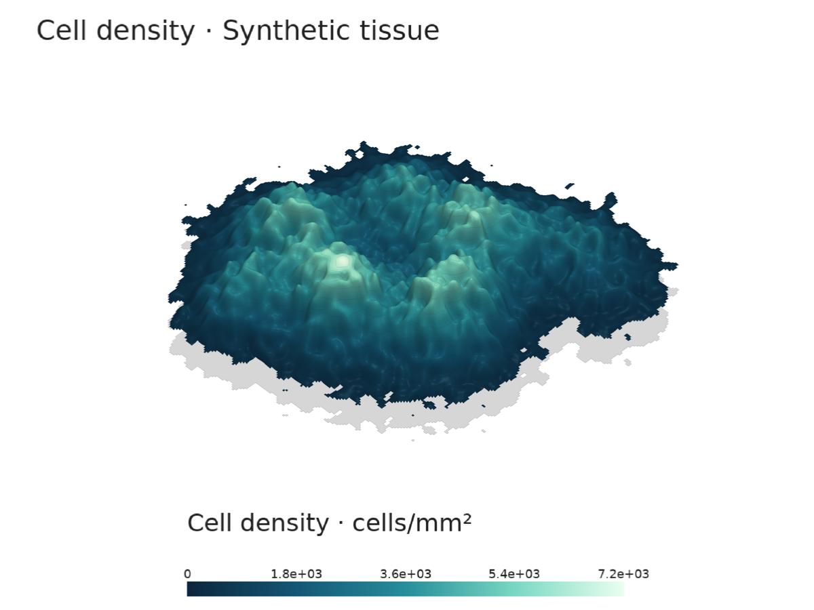
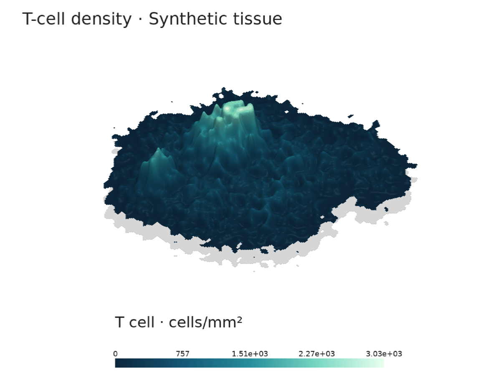
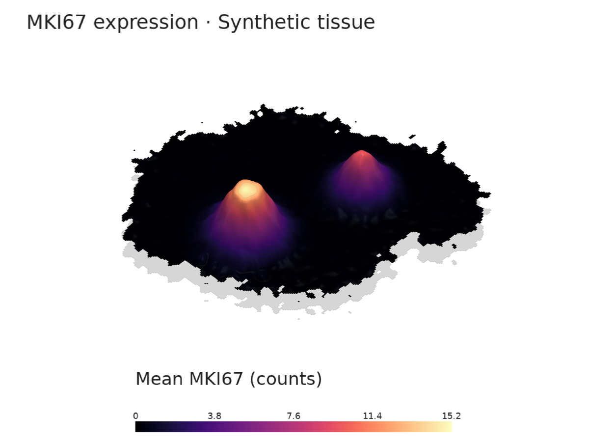
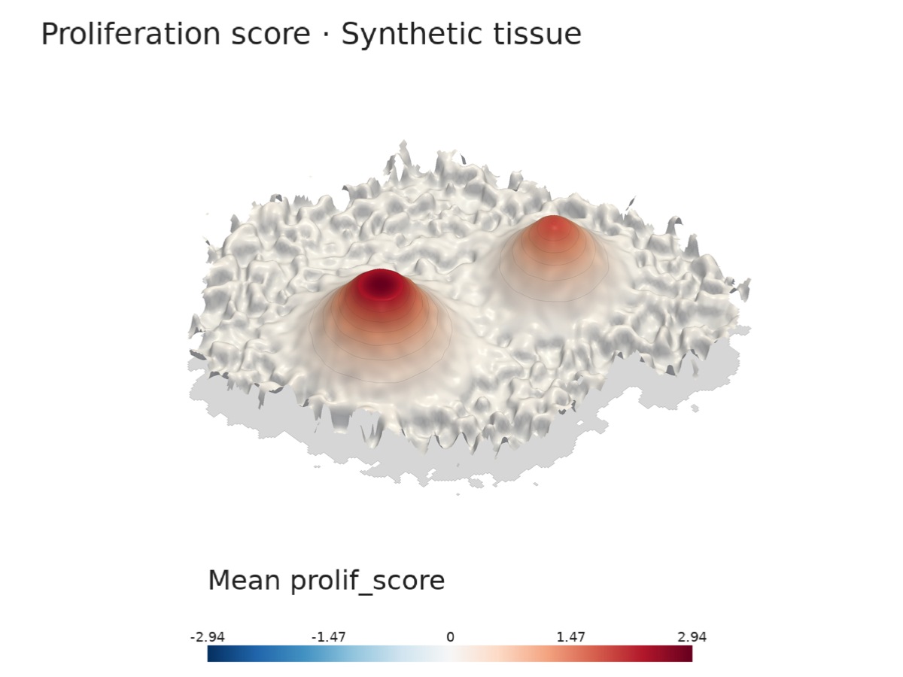
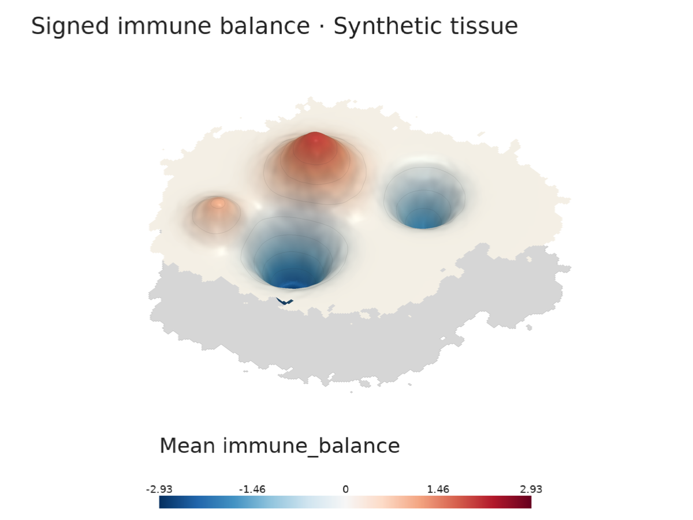
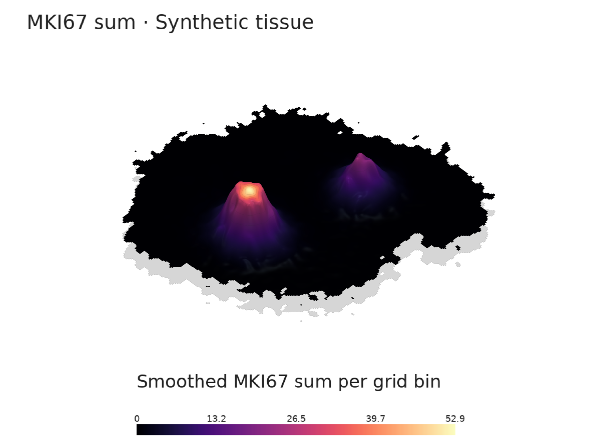
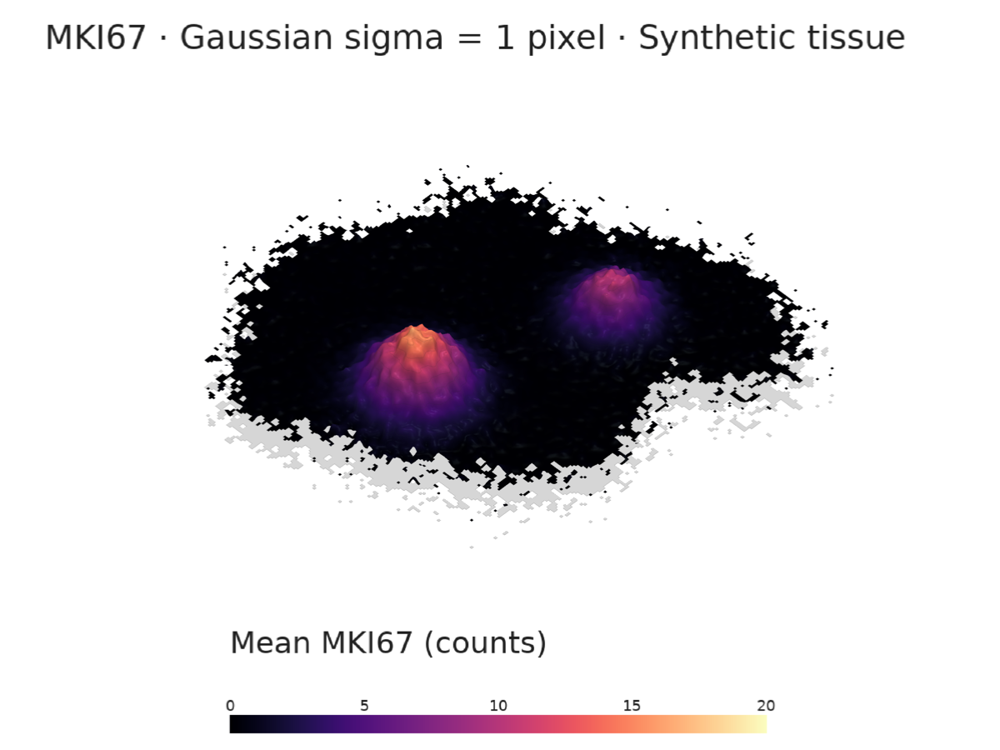
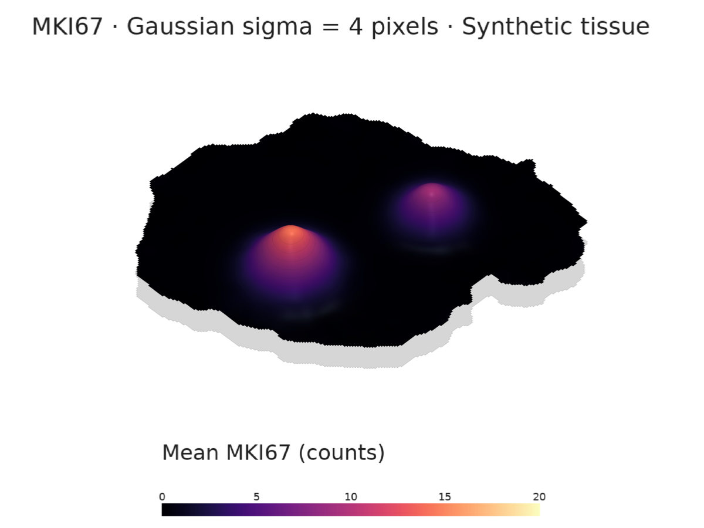
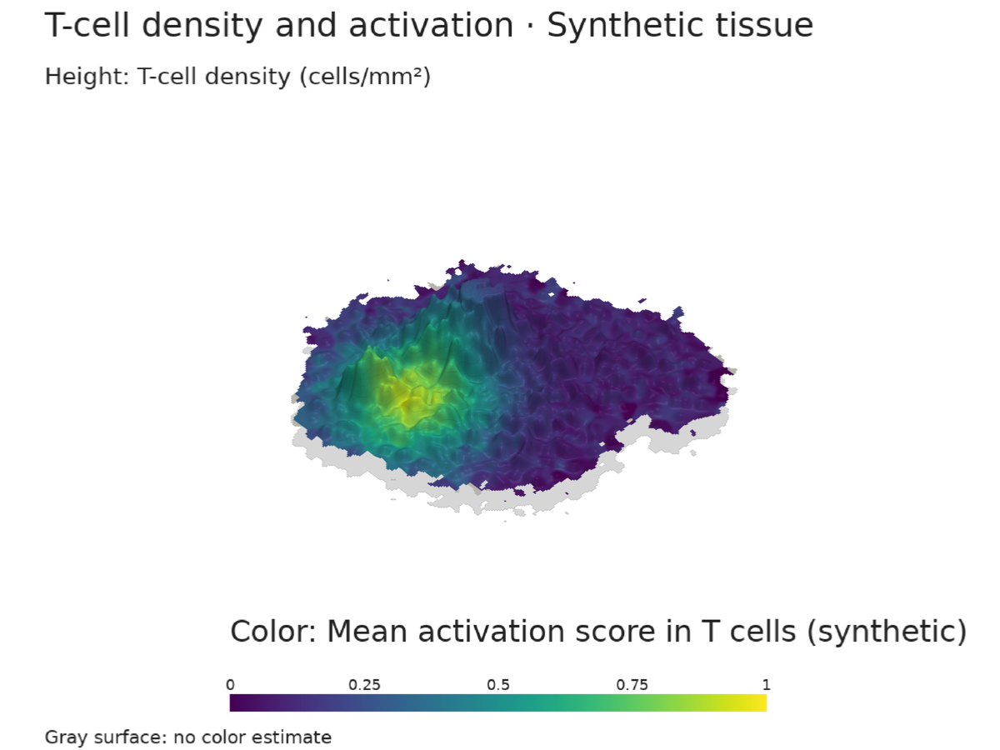

# Recipes

## Reproduce the gallery

The gallery below uses seeded **synthetic** tissue, with no downloads or private
data. Start a Python session with:

```python
import scalps as sca

adata = sca.demo(seed=7)
view = dict(height=0.16, skirt=False, contours=8, window_size=(1200, 900))
```

The examples use these shared display settings. Height represents the selected
measurement, not physical tissue elevation. Replace `adata` with your own data
and check its gene names, annotations, layers and coordinate units.

From a repository checkout, regenerate all ten PNGs and their JSON settings:

```bash
python examples/recipes.py
python examples/recipes.py --output outputs/my-recipes
```

The default destination is `docs/assets/recipes/`. The
[gallery script](https://github.com/philinscience/scAlps/blob/main/examples/recipes.py)
also records the exact titles, palettes and limits used for these figures.
For headless rendering, see [running on servers](index.md#running-on-servers-and-in-notebooks).

## All-cell density

```python
mountain = sca.terrain(adata)
mountain.plot(**view, preset="glacier", title="Cell density · Synthetic tissue")
```



With no value supplied, height and color show Gaussian-smoothed cell density.
The demo coordinates are in micrometers, so the default density is cells/mm².
For uncalibrated coordinates, use `unit="native coordinate units", density_scale=1`;
changing `unit` alone does not rescale coordinates or density.

## Cell types and local fractions

```python
mountain = sca.terrain(adata, groupby="cell_type", groups="T cell")
mountain.plot(**view, preset="glacier", title="T-cell density · Synthetic tissue")

fraction = sca.terrain(
    adata, groupby="cell_type", groups="T cell", statistic="fraction",
)
fraction.plot(
    **view, preset="glacier", clim=(0, 1), vmax=1,
    title="Local T-cell fraction · Synthetic tissue",
)
```

| T-cell density | Local T-cell fraction |
| --- | --- |
|  |  |

Density counts selected cells per area; fraction divides their smoothed count
by the smoothed all-cell count. A dense region need not have a high fraction.
Both retain the all-cell tissue footprint. `vmax=1` and `clim=(0, 1)` give
fractions a fixed height and color scale. To combine populations, pass a list
such as `groups=["T cell", "Tumor"]` using categories present in your data.

## Expression and scores

```python
mountain = sca.terrain(adata, "gene:MKI67", layer="counts")
mountain.plot(**view, preset="ember", title="MKI67 expression · Synthetic tissue")
```



Gene expression defaults to a local cell-weighted mean: smoothed expression
sums divided by smoothed counts of cells with finite measurements. Zeros
contribute to the mean; missing values do not. The demo's `counts` layer contains
synthetic counts. Prepare normalized expression upstream and pass its layer
when appropriate; scAlps does not normalize expression.

```python
score = sca.terrain(adata, "obs:prolif_score")
score.plot(**view, transform="sqrt", title="Proliferation score · Synthetic tissue")

balance = sca.terrain(adata, "immune_balance")
balance.plot(**view, cmap="RdBu_r", title="Signed immune balance · Synthetic tissue")
```

| Continuous score | Signed score |
| --- | --- |
|  |  |

The `gene:` and `obs:` prefixes disambiguate duplicate names. `sqrt` and `log1p`
change only the height mapping, preserving signs; color and numerical exports
retain the aggregated values. Signed scores produce peaks and valleys and
automatically use a diverging palette unless a colormap is supplied.

### Summed expression

```python
mountain = sca.terrain(adata, "MKI67", layer="counts", statistic="sum")
mountain.plot(
    **view, preset="ember", title="MKI67 sum · Synthetic tissue",
    scalar_bar_title="Smoothed MKI67 sum per grid bin",
)
```



`sum` smooths expression totals per grid bin without dividing by cell count.
It reflects both cell abundance and expression, and changes with grid spacing.
It is neither mean expression nor an area-normalized expression density.

## Resolution and smoothing

```python
for sigma in (1, 4):
    mountain = sca.terrain(
        adata, "MKI67", layer="counts", resolution=250, smooth=sigma,
    )
    mountain.plot(
        **view, preset="ember", vmax=20, clim=(0, 20),
        title=f"MKI67 · Gaussian sigma = {sigma} pixels · Synthetic tissue",
    )
```

| Sigma = 1 grid pixel | Sigma = 4 grid pixels |
| --- | --- |
|  |  |

Both panels use the same data, resolution, height scale and color limits.
Larger `smooth` values suppress local variation and can join nearby tissue
regions. `resolution` sets the longest unpadded grid dimension; `smooth` is the
Gaussian sigma in grid pixels, not coordinate units. The physical sigma is
`smooth * mountain.metadata["spacing"]`. Smoothing also affects support and
outskirts trimming; it is not just a display effect. See
[comparing slides](#comparing-slides) before interpreting differences across samples.

## Independent height and color

Use `color` for a second measurement. Height and contours continue to follow
`value`, or density when `value` is omitted. Both fields use the same selected
cells, coordinates, grid and smoothing; each handles missing values separately.

```python
adata = sca.demo()
mountain = sca.terrain(
    adata, groupby="cell_type", groups="T cell",
    color="activation_score",  # explicitly synthetic demo score
)
mountain.plot(
    **view, cmap="viridis", clim=(0, 1),
    title="T-cell density and activation · Synthetic tissue",
    height_label="T-cell density (cells/mm²)",
    scalar_bar_title="Mean activation score in T cells (synthetic)",
)
```



For GS52, use its T-cell annotation and supplied Cd8a expression. The coordinate
calibration is unknown, so retain native units and use `density_scale=1`:

```python
mountain = sca.terrain(
    adata, groupby="Level_2", groups="Lymphoid - T cells",
    color="gene:Cd8a", color_layer="log1p_norm",
    unit="native coordinate units", density_scale=1,
)
mountain.plot(
    cmap="viridis", title="GS52 · T-cell density and Cd8a",
    height_label="T-cell density (cells / native coordinate unit²)",
    scalar_bar_title="Mean Cd8a in T cells (log1p_norm)",
)
```

This color is mean Cd8a expression among nearby annotated T cells, not an
activation score or the fraction of Cd8a-positive cells. No expression
normalization or scoring is applied by the plotting tool.

For a standalone height-and-color example with a PNG, numerical export and
optional slow GIF, use the script below. For real files it loads only the
requested expression column, metadata and coordinates:

```bash
python examples/height_and_color.py  # synthetic score example
python examples/height_and_color.py --input /path/to/GS52_spatial.h5ad --output outputs/GS52-Cd8a --gif
```

Choose `--color-gene`, `--layer`, `--groupby` and `--group` for other datasets.
For example, GS52 annotates malignant cells as `Level_1="Tumor"`:

```bash
python examples/height_and_color.py --input /path/to/GS52_spatial.h5ad --groupby Level_1 --group Tumor --population-label "Malignant cells" --color-gene Vegfa --output outputs/GS52-malignant-Vegfa --gif
```

`--population-label` changes only the displayed name; selection still uses the
exact annotation in `--group`.

Color defaults to a local cell-weighted mean; `color_statistic="sum"` instead
shows a smoothed sum per grid bin. `color_layer` defaults to X independently
of the height field's `layer`. Arrays and prefixed gene/obs names also work.

The caption identifies height and the color bar identifies color. `vmax` and
`transform` affect height only; `clim` and `cmap` affect color only. Missing color
estimates are gray, while measured zeros stay on the color scale. The flat
gray tissue underneath remains a spatial reference. Without `color`, plots
keep the original single-field behavior.

## Figure styling and transparent export

All presets default to white. The color bar has a separate panel, with regular
sans-serif labels and a label row above the ticks. Gene names appear in the
figure title and in the mean/sum legend label; the two cannot overlap.

```python
mountain = sca.terrain(adata, "Mki67", layer="log1p_norm")
mountain.save("outputs/Mki67.png", preset="ember", skirt=False,
              scalar_bar_title="Mean Mki67 (log1p_norm)")
mountain.save("outputs/Mki67_transparent.png", transparent_background=True)
```

The figure contains no branding. To omit its title, pass `title=""`. Disabling
`scalar_bar` also removes the reserved legend space. The returned plotter's
active renderer is the terrain, so camera customization still works normally.

## Real Xenium h5ad example

```bash
python examples/xenium.py /path/to/GS52_spatial.h5ad --output outputs/GS52 --gif
```

This example plots `Mki67`, `Krt19`, and `Cd3e` from the supplied `log1p_norm`
layer, all-cell density, and T-cell density when the expected `Level_2`
annotation is present. It includes a transparent PNG and a source/settings
manifest. `--gif` adds a slow orbit of the first gene. Use `--genes` and `--layer`
to select other genes or layers, or `--density-percentile 0` to disable trimming.

The script reads only the requested sparse gene columns, cell metadata, and
coordinates. It does not change the source file, normalize expression, or
perform imputation. Output stays in the ignored `outputs/` directory.

Coordinate units default to **native coordinate units**. A key called
`spatial` does not itself establish micrometers. If the calibration is known
to be micrometers, pass `--unit µm --density-scale 1000000` to report cells/mm².
The file's layer name is retained in the legend rather than implying that
log-normalized values are raw transcript counts.

## Sparse outskirts and flat tissue reference

```python
# Default: trim the lowest 1% of local all-cell densities sampled at cells.
mountain = sca.terrain(adata, "Mki67", density_percentile=1)
mountain.plot(footprint=True, footprint_color="#d6d6d6", footprint_gap=0.06)

# Show the original support, or omit the reference layer.
untrimmed = sca.terrain(adata, "Mki67", density_percentile=0)
untrimmed.plot(footprint=False)

mountain.save("outputs/slow.gif")  # ~24-second orbit
mountain.save("outputs/slower.gif", frames=480, fps=10)  # 48 seconds
```

Trimming is based on all cells, not low expression or the density of a selected
cell type. Thus rare T cells inside well-sampled tissue remain visible. The gray
layer uses the same cleaned all-cell footprint for all genes and cell types,
including regions where a selected-cell mean has no valid measurements. It sits
below the lowest valley and any skirt, preserving x/y alignment and tissue holes.
It is a spatial reference, not another measurement or a physical tissue height.

## Export figures, interactive scenes and numerical data

```python
mountain = sca.terrain(adata, "MKI67", layer="counts")
mountain.save("outputs/MKI67.png", **view, preset="ember")
mountain.save("outputs/MKI67-transparent.png", **view, transparent_background=True)
mountain.save("outputs/MKI67.html", **view, preset="ember")
mountain.save("outputs/MKI67.gif", **view, preset="ember", frames=360, fps=15)
mountain.save("outputs/MKI67.npz")
mountain.save("outputs/MKI67.vtp", height=view["height"])
```

| Format | Use |
| --- | --- |
| PNG | Static figure; optional transparent background |
| HTML | Standalone interactive scene with rotation, zoom and pan; requires the `notebook` extra |
| GIF | Orbit animation; 360 frames at 15 fps take 24 seconds |
| NPZ | Aggregated values, coordinates, counts and support masks, before height mapping |
| VTP | Terrain mesh for PyVista or ParaView; accepts `height`, `vmax` and `transform` |

Every export writes a `.json` settings sidecar next to the file. Existing files
at the chosen paths are overwritten. With independent color, NPZ also includes
`color_values` and `color_mask`, and VTP includes a `color` point array.

Read the numerical grid without a renderer:

```python
import numpy as np

with np.load("outputs/MKI67.npz") as grid:
    values = np.where(grid["mask"], grid["values"], np.nan)
    x, y = grid["x"], grid["y"]  # values use (x, y) indexing
```

To exercise every export format as well as regenerate the gallery:

```bash
pip install -e '.[notebook]'
python examples/recipes.py --exports
```

The additional exports go to `outputs/recipes/`. HTML export temporarily uses
a localhost server; PNG, HTML and GIF need a working rendering backend.

## SpatialData with transformed geometry

```python
sca.plot(
    sdata,
    "MKI67",
    table="table",
    element="cell_boundaries",
    coordinate_system="global",
    preset="ember",
)
```

The table must annotate this element using SpatialData's region and instance
metadata. Only rows in the selected element are used. Centroids are transformed
and joined by instance ID. Shapes, labels and points are supported by
[SpatialData's centroid API](https://spatialdata.scverse.org/en/latest/api/operations.html).
For arrays passed as `value`, supply one value per retained table row.

## Custom PyVista composition

```python
mountain = sca.terrain(adata, "MKI67")
p = mountain.plot(show=False, preset="ember", scalar_bar=False, contours=0)
p.add_axes()
p.camera.elevation = 35
p.show()
```

For complete control, `mountain.mesh()` returns a PyVista `PolyData` with
`value` and `support` point arrays in the original x/y coordinate system.
The plotter's default image orientation reverses y for Xenium. Set
`image_coordinates=False` for Cartesian data.

## Comparing slides

Use the same value preprocessing, coordinate units, `vmax`, `clim`, `height`
and transform. Automatic per-slide peak scaling does not convey comparable
absolute height. `smooth` is measured in grid pixels, so equal values do not
imply equal physical bandwidth across slides of different extent. Inspect
`mountain.metadata["spacing"]` and choose resolution/smooth accordingly.

## Large slides

```python
import anndata as ad

adata = ad.read_h5ad("slide.h5ad", backed="r")
try:
    mountain = sca.terrain(adata, "MKI67", resolution=300)
    mountain.save("outputs/slide.png", preset="ember")
finally:
    adata.file.close()
```

The requested gene is sliced before materializing X. AnnData's backed mode can
still load layers and other annotations eagerly; for files with large layers,
the selective HDF5 example above avoids loading unrelated layers and embeddings.
Start at resolution 250–400. Doubling resolution roughly quadruples mesh size.
SpatialData label centroids may require scanning the whole segmentation image.
